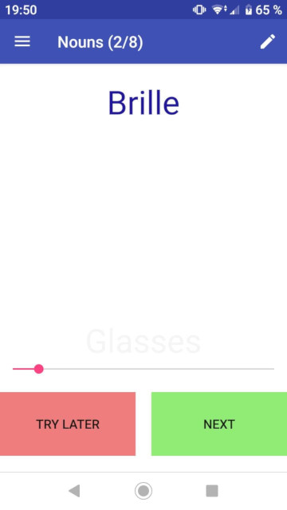

# FlashCards

This is a very simple flash card app for Android that I wrote ~~instead of~~ for the purpose of learning German vocabulary. The point is that I can decide very quickly whether I know a word or not, but most flash card apps make you go through a very slow process of typing out a word or otherwise verifying that you know it. Since I'm the only one that loses if I cheat, I realised it would be good to make the process as efficient as possible.

Here's how it works:
- The app loads all the cards from a deck into a queue in a random order
- It shows you the first card in the queue
- If you recognise that you already knew the answer before looking at it, you can press NEXT
- If you have to look at the answer yourself, you should press TRY AGAIN, and the card will be re-inserted into the queue so it is shown to you again within the next few cards
- When you empty the queue, it will repopulate the queue and start again. The background turns red to let you know that you finished all the cards.

The "front" of the card is shown at the top of the screen, and the "back" is shown at the bottom in very faint text. The idea is that you can't read the back of the card unless you look directly at it. This makes it very easy to check your answer without having to interact with anything. There's a slider to make the font as dim as it needs to be so you can't read it accidentally.

